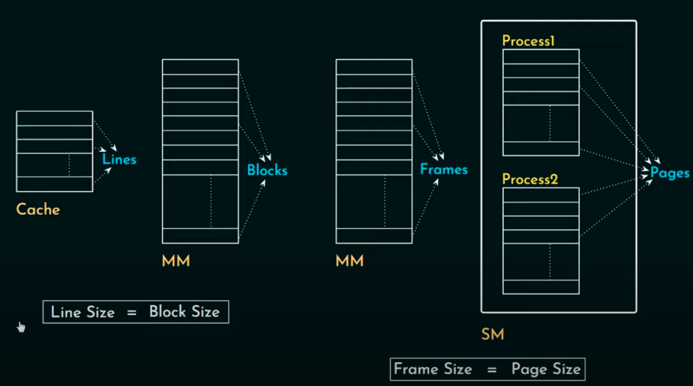
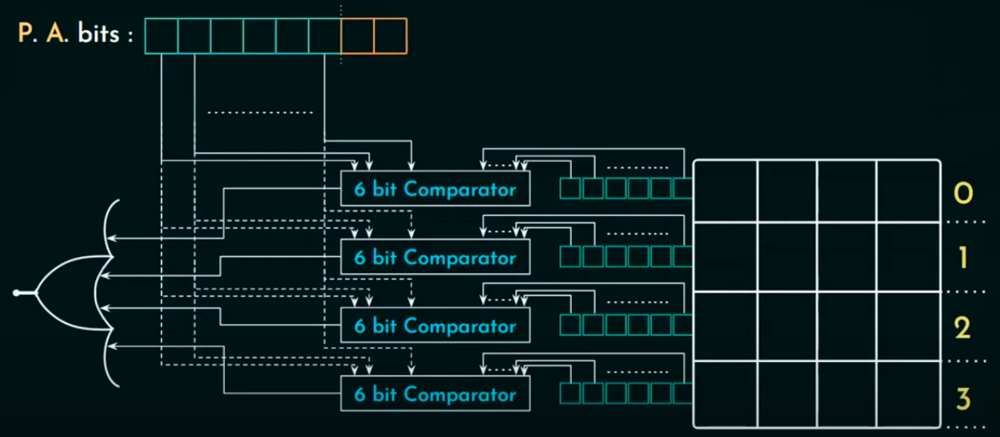
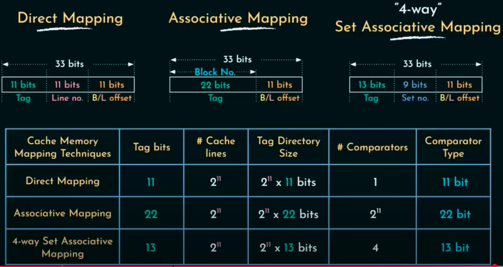

# Cache memory
* Modern day systems have 3 levels of cache
* Dual core, Quad core or Octa Core are based on MIMD architecture.
* All L1, L2 and L3 cache are embedded into the processor.
* Different cores of processor have their own L1 and L2 caches interfaced in parallel.
* L3 cache is shared between all the cores and it is also called as shared Cache.
* W.r.t memory size of cache, L3 > L2 > L1

## Cache related terms:
* Cache hit
    - Time required by this process is called `Hit latency`
    - Using the data structure `Tag Directory`, processor finds out if data is present in cache or not
* Cache miss and Miss latency
    - If the data is missing in cache, then it is called `Cache miss` and then the processor will look for data in Main memory. If it finds the data there, then processor will place it in cache.
    - This entire period of time is called `Miss Latency`
* Page fault or page hit
    - If data is not found in main memory then it is called `Page fault`.
    - If data is found, then `page hit`.
* Page fault service time
    - If data is not found in main memory and the time needed by the processor to go to the secondary memory and fetch it.

## Locality of reference
* Spatial locality
    - If a memory location is referenced by processor then there is a high probability that processor will seek for data around the same memory location
* Temporal locality
    - If a memory location is referred by processor then there is a higher probability that processor will refer the same memory location again.

## Direct memory mapping
* Programs in the computer reside in the secondary memory.
* Main memory is divided into equal size frames.
* Secondary memory (programs are called processes) is divided into equal size pages.
* The process of dividing the sub-processes (program) into pages and then bringing into the main memory is the function of OS.
* Main main-memory is divided into blocks and cache is divided into lines.

* Smallest addressable unit of memory is called `Word`.
* Physical address bits
    - MSB are used to identify the blocks
    - LSB are used to identify the words in the blocks
    - LSB are called block/line offset
    - Rest of them are called line number
    - 2 MSB are called tag bits

## Hardware Implementation

* Comparator and mux are used.
* XNOR GATE for comparator
* Output of comparator denotes hit or miss
* Hit LAtency = ( Time taken by Mux ) * ( Time taken by n-bit comparator)
* Comparator delay is much higher than Mux delay, therefore mux delay can be neglected.

## Associative Mapping

* Different types of misses (3 C's)
    - Compulsory miss (cold miss)
        It occurs when a memory location is accessed for the first time.
    - Conflict miss (collision miss or interference miss)
        It occurs when we refer to the words that got replaced with other information in the cache
    - Capacity miss
        The data used for computation is called `working set`. When `working set` is bigger than the cache then capacity miss occurs.
    - coherence miss
    - coverage miss
    - system related miss

* The solution to conflict miss is associative mapping
* It follows many to many relation
* Hardware implementation
    

* Summary
    As the words in a cache block get replaced and OS does not know about it. It leads to conflict miss. To deal with conflict miss, associative memory is used. Associative memory is very flexible as any main memory block can be related to any cache lines. But this introduces complexity in the circuit as every cache line needs to have a comparator.

## Set Associative mapping

* Lines of cache memory as sub divided into sets.
* A set can contain K lines, in a `m-number` cache memory.
* PA bits of the memory block are related to the set assigned in the cache.
* It is the most popular design.

# Comparative study

# Cache Design

* Block placement
* Block identifiction
* Block Replacement
* Write strategy
