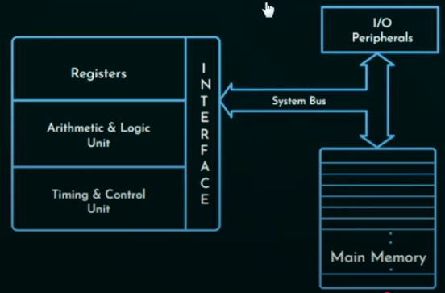
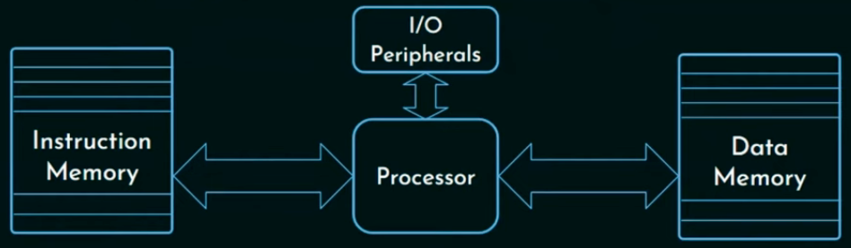
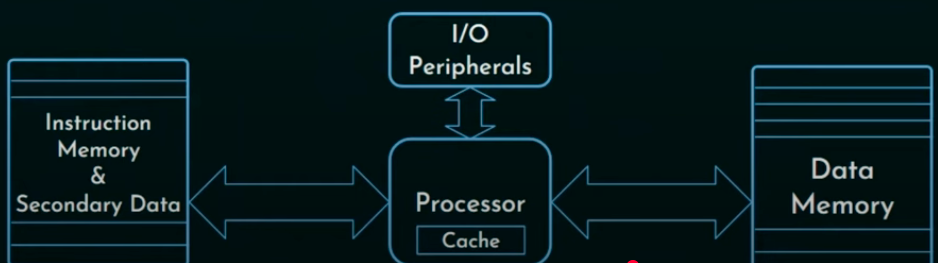

* It is the design of computers, including their instruction sets, hardware components and system organization.
* It has two parts
    * Instruction set architecture
    * Hardware system architecture
* HSA is realization of computer on hardware.

## Classifications
* Von Neumann architecture (Princeton architecture)
    
    * CPU
    * Memory
    * I/O Peripherals
    * System bus
    * It must be a stored memory program
    * It carries out instructions sequentially
    * There is only one path between main memory and processor.
    * Von Neumann bottleneck
        * The data and program is stored in the same memory.
        * Both data and program are accesses through the single system bus.
        * Therefore, a bottleneck of accessing data or program.

* Non-Von Neumann architecture (Harvard architecture)
    
    * They used two memory units
    * There are two paths, 1 to access instruction memory and the other for data.
* Modified Harvard Architecture
    
    * A processor is accompanied by cache
* SISD
    * Single instruction stream, single data stream
    * CPU fetches one instruction at a time and operates 1 data or result at a time.
* SIMD
    * Single instruction stream, multiple data stream
    * It has more than 1 ALU
    * Single instruction stream but multiple data or operate streams
    * Single control signal is generated
* MISD
    * Multiple instruction stream and single data stream
* MIMD
    * Multiple instruction stream and multiple data stream

