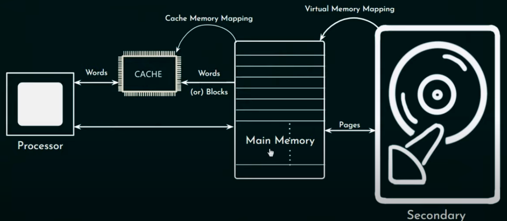

# Intro

* Anything that can be stored in the computer as 1 & 0 in memory cells.
* Bigger the memory, slower it becomes to access data.
* Primary/Main memory (RAM) - volatile
    * Dynamic RAM
        - In each memory chip there is a transistor along with a capacitor.
        - The value from the memory cell can be retained as long as there is a charge in the capacitor.
    * Static RAM (Cache)
        - It does not have capacitor
        - It is the fastest memory
* Secondary memory (ROM)
    * They are slower than RAM
    * Retains data
* RAM and cache exchange data in words or blocks
* RAM and ROM exchange data in pages
* OS must be capable of doing demand paging

# Memory Hierarchy

* Hierarchy based on access time and size and vice-versa for Hierarchy based on cost and usage frequency
    - Registers, flip-flops
    - S.RAM
    - D.RAM
    - secondary memory like hard disks

## Memory interfacing

* Deals with the way of connecting various levels of memory units to processor and I/O peripherals
* MIPS (Million instructions per second)
* If (n)th level is a subset of (n+1)th level of memory; if processor seeks for data in nth level and finds it then it is called `HIT` otherwise `MISS`. That implies, the time considered for processor to look for something in memory shall be for both (n)th and (n+1)th level. But in reality, it does not take so much time. It depends on how the interfacing has been done.
* Hit Ratio
    - No. of instructions in main memory / Total number of intructions
* Way 1: All the memory units are parallely connected to processor.
    - Effective/Average memory access time:
        * ( H1 * T1 ) + (((1-H1) * H2) * T2) + ((1-H1 * 1-H2) * T3)
        * (1 - H1) or (1 - H2) is when we miss a `hit` in memory.
* Way 2: All the memory units are connected in series to processor.
    - Effective/Average memory access time:
        * (H1 * T1) + (((1-H1) * H2) * (T1 + T2)) + ((1-H1 * 1-H2) * (T1+T2+T3))
